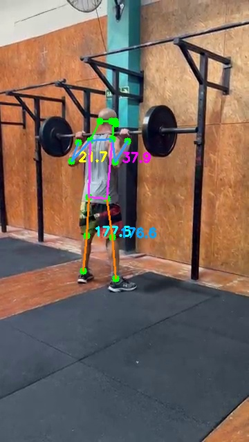
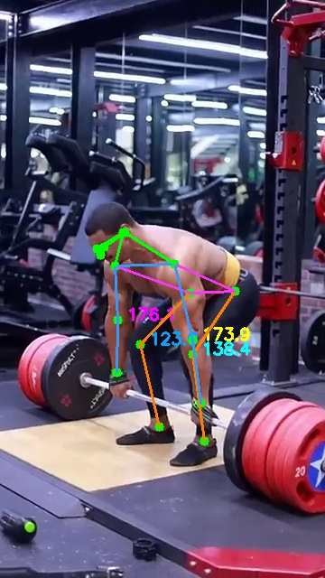
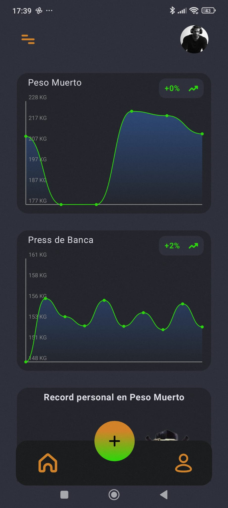
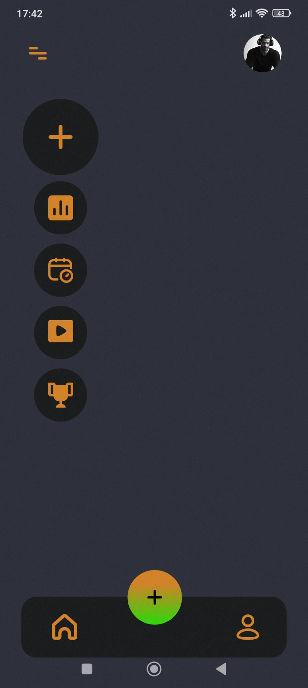
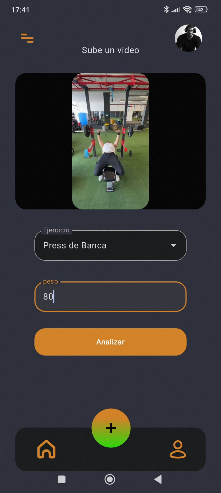
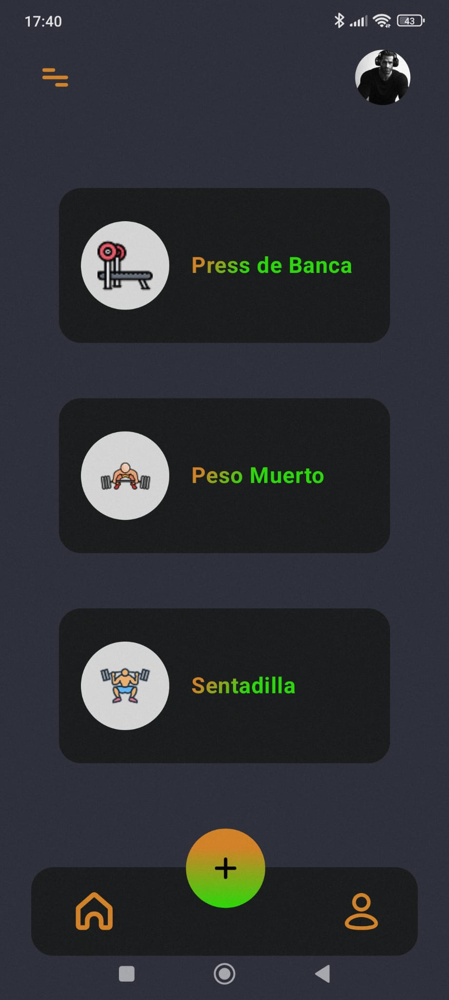
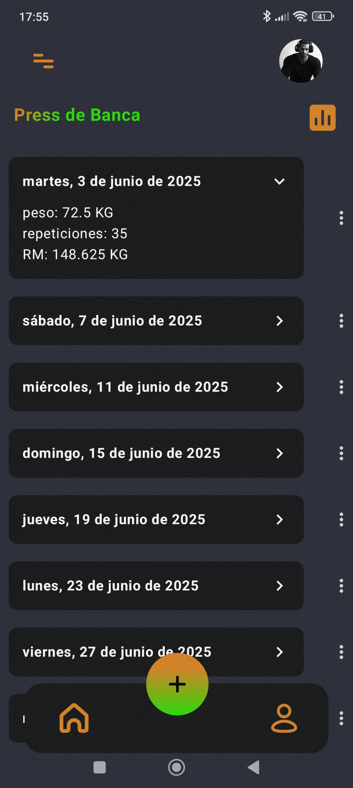
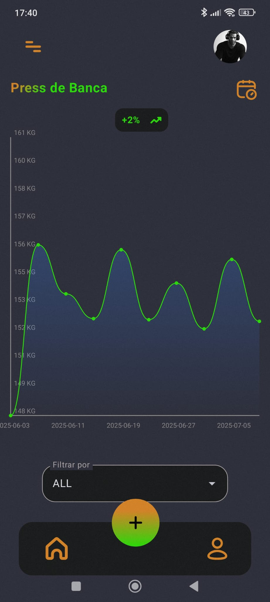
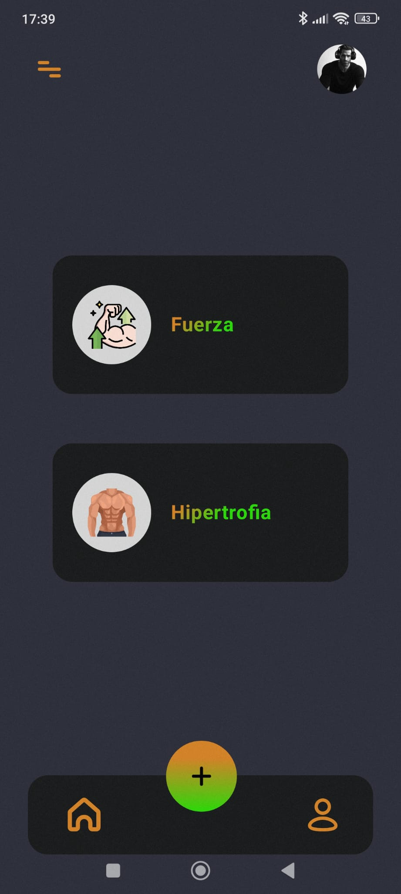
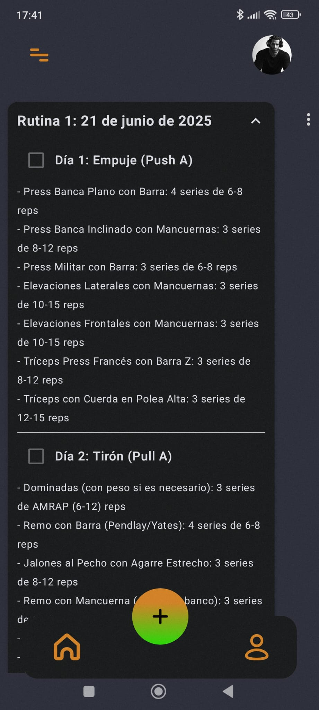

# GymTrakercAI: Aplicación Inteligente para el Seguimiento de Entrenamiento de Fuerza

## Descripción del Proyecto

**GymTrakercAI** es una aplicación móvil desarrollada como parte del Trabajo Fin de Título del Grado en Ingeniería Informática. La aplicación fusiona tecnologías de **inteligencia artificial** con **entrenamiento de fuerza**, permitiendo a los usuarios analizar su rendimiento físico mediante algoritmos avanzados de visión por computador y generación de lenguaje natural.

El sistema es capaz de:
- Detectar automáticamente la **pose humana** durante la ejecución de ejercicios de fuerza.
- Parametrizar el movimiento (repeticiones, duración, ángulos articulares).
- Estimar la **repetición máxima (1RM)** mediante fórmulas científicas.
- Generar rutinas de entrenamiento personalizadas mediante un **modelo de lenguaje (LLM)**.

---

  

## Características Principales

### Detección y análisis de ejercicios

- Estimación automática de **poses humanas** usando modelos avanzados de visión por computador (VitPose [1] + YOLOv8x [2]).
- Análisis de ejercicios como **press de banca**, **sentadilla** y **peso muerto**.
- Cálculo de:
  - Número total de repeticiones.
  - Duración individual de cada repetición.
  - Ángulos de las articulaciones principales.
  - Estimación de la 1RM con métricas relativas al peso corporal.

### Seguimiento inteligente

- Registro histórico de levantamientos con **gráficas interactivas**.
- Clasificación del nivel de fuerza por ejercicio.
- Posibilidad de guardar videos procesados sin ocupar almacenamiento local.

### Generación de rutinas personalizadas (LLM)

- Integración con **Gemini API** para la generación de rutinas de entrenamiento.
- Personalización de rutinas de **hipertrofia o fuerza** según el historial del usuario.
- Respuestas generadas a través de IA adaptadas al nivel físico.

---

  
  

## Seguridad y arquitectura

- Comunicación entre cliente y servidor mediante protocolo **HTTPS**.
- Uso de **tokens JWT (Firebase)** para autenticación segura.
- Implementación de un servidor API con **Flask + NGINX**, desacoplando el modelo IA de la lógica de la aplicación.
- Verificación de acceso restringido para el procesamiento de IA mediante un token personalizado del worker.

---

## Tecnologías utilizadas

- **Lenguaje**: Kotlin (Jetpack Compose)
- **Backend**: Python (Flask + NGINX)
- **IA Visión**: VitPose Plus Large + YOLOv8x
- **IA Lenguaje**: Gemini 1.5 Flash API (via Google AI Studio)
- **Base de Datos**: Firebase Realtime Database
- **Infraestructura**: Servidor Linux, certificado SSL, dominio personalizado

---

## Capturas de la aplicación

  
  
  
  

  
  
  
  
  

---

## Autor y proyecto académico

Este proyecto ha sido desarrollado como parte del Trabajo Fin de Título en la **Universidad de Las Palmas de Gran Canaria (ULPGC)**, combinando motivación personal con aplicación de conocimientos técnicos avanzados.

**Autor:** Juan Jesús Suárez Miranda    
**Curso académico:** 2024-2025

---

## 📬 Contacto

Para más información o colaboración:
- Correo: jjsmx24@gmail.com
- LinkedIn: [[Juan Jesús Suárez Miranda]](https://www.linkedin.com/in/juan-jesus-suarez-miranda-8a659520b/)

## Referencias
[1] vaswani2023attentionneed, "Attention Is All You Need", arXiv:1706.03762, 2023. [En línea]. Disponible en: https://arxiv.org/abs/1706.03762
[2] redmon2016lookonceunifiedrealtime, "You Only Look Once: Unified, Real-Time Object Detection", 2016. [En línea]. Disponible en: https://arxiv.org/abs/1506.02640
